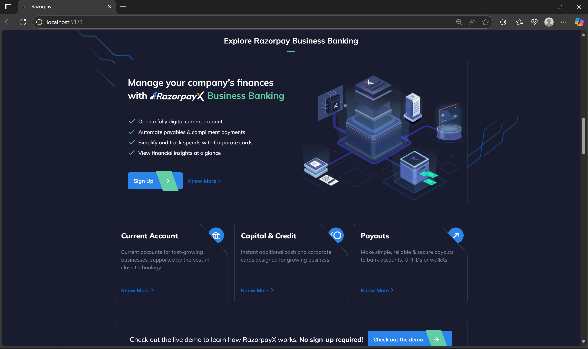
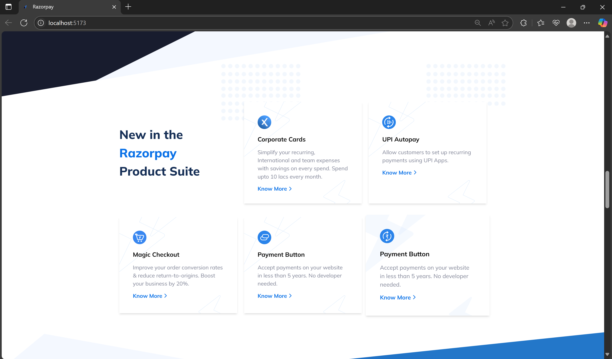
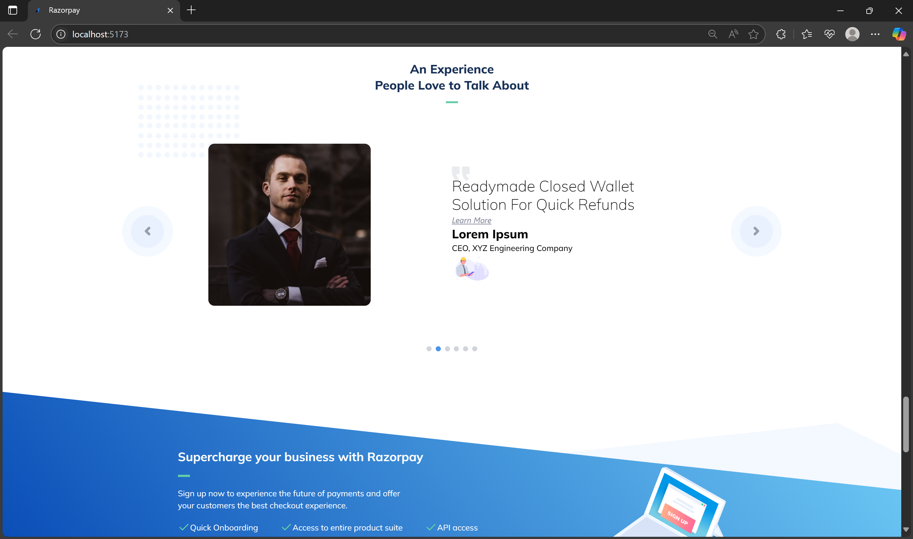
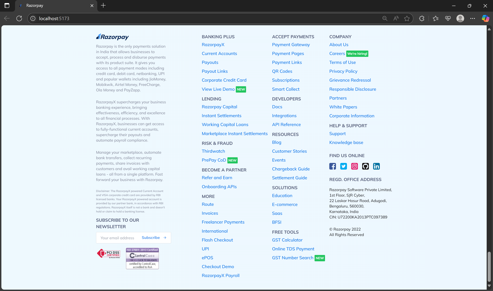

# Razorpay Clone (Tailwind CSS)

This is a responsive Razorpay landing page clone built using **HTML**, **Tailwind CSS**, and **JavaScript**. The objective of this project is to replicate the user interface and layout of Razorpay’s official homepage, showcasing modern UI design techniques and Tailwind utility classes.

---

## 🚀 Features

- Responsive layout for different screen sizes  
- Navbar with dropdown indicators  
- Hero section with call-to-action  
- Multiple feature sections showcasing Razorpay services  
- Tailwind CSS-based animations and hover effects  
- Custom gradient backgrounds and illustrations  
- Feather icons integration  
- Fully mobile-first and utility-driven CSS  

---

## 🛠 Technologies Used

- HTML5  
- Tailwind CSS (v3+)  
- PostCSS  
- JavaScript (Feather Icons)  

---

## 📁 Project Structure

```
.
├── images/               # All static images and icons
├── node_modules/         # Node dependencies
├── screenshots/          # screenshots of webpage
├── index.html            # Main HTML page
├── main.css              # Tailwind-processed CSS
├── postcss.config.js     # PostCSS config for Tailwind
├── tailwind.config.js    # Tailwind CSS config file
├── package.json          # Project metadata and dependencies
└── README.md             # Project documentation
```

---

## 🧰 Getting Started

### 1. Clone the repository

```bash 
git clone https://github.com/ArshnoorSingh07/Razorpay-Clone-Project.git
cd Razorpay-Clone-Project
```

### 2. Install dependencies

Make sure Node.js is installed on your system, then run:

```bash
npm install
```

### 3. Start Tailwind watcher

To compile Tailwind CSS and watch for changes:

```bash
npx tailwindcss -i ./main.css -o ./dist/output.css --watch
```

Open `index.html` in your browser to view the live version.

---

## 📷 Screenshots

### 🏠 Homepage


### ✨ Features Section



### 📄 Testimonial and CTA Section



### 📄 Footer Section


---

## 📌 Notes

- This project is built purely for educational and portfolio purposes.  
- All trademarks, logos, and brand assets belong to Razorpay.  

---

## 📄 License

This project is licensed under the [MIT License](LICENSE).
