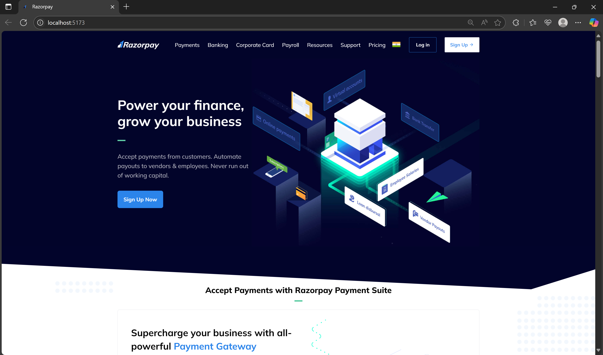
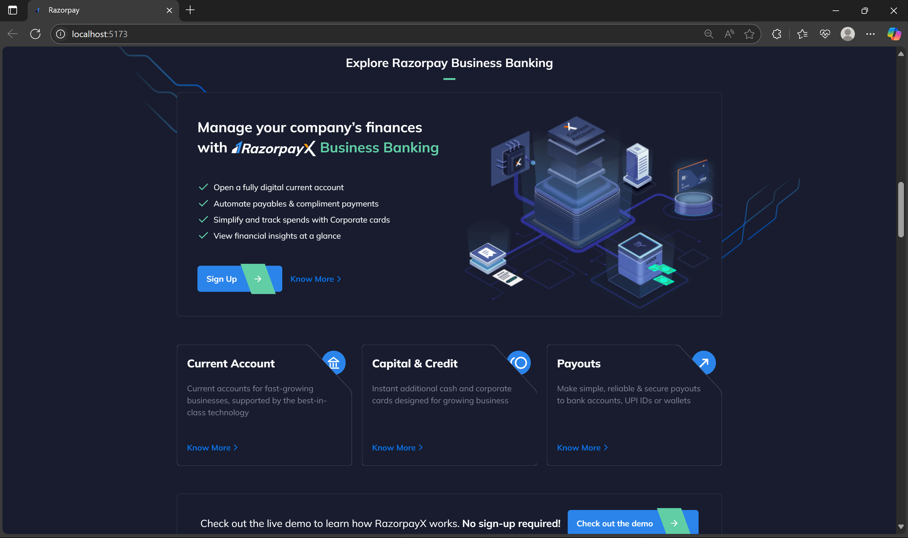
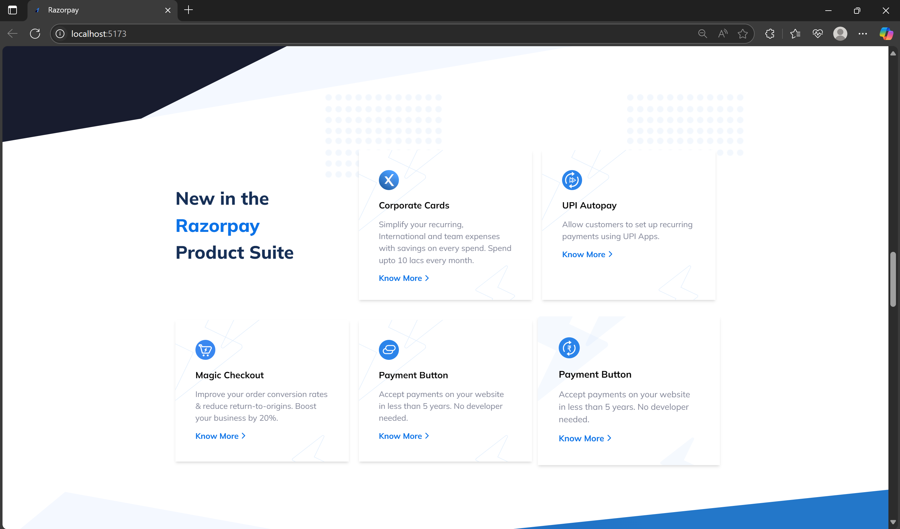
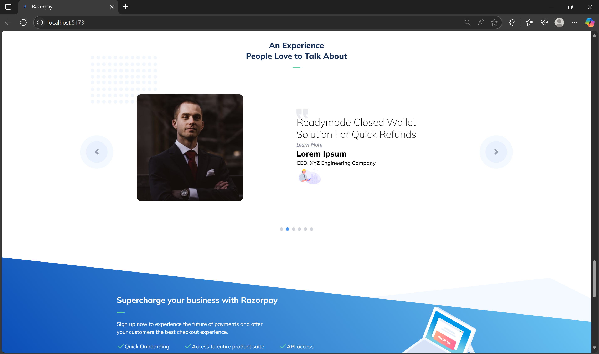
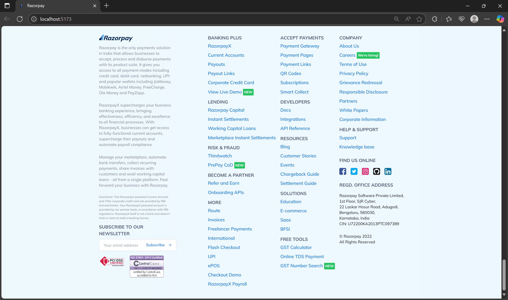

# Razorpay Clone (Tailwind CSS)

A fully responsive Razorpay Landing Page Clone built using **HTML5**, **Tailwind CSS**, and **JavaScript**. This project recreates the user interface of the official Razorpay homepage while following modern UI/UX principles and responsive web design practices.

The primary objective of this project is to strengthen frontend development skills by implementing a real-world landing page using Tailwind CSS and utility-first styling.

---

## Live Demo

**Website:**  
https://razorpay-clone-project-kappa.vercel.app/

---

## Features

- Fully responsive design for desktop, tablet, and mobile devices
- Modern Razorpay-inspired landing page UI
- Responsive navigation bar
- Hero section with call-to-action buttons
- Multiple feature and product sections
- Utility-first styling with Tailwind CSS
- Interactive hover effects and smooth transitions
- Gradient backgrounds and custom layouts
- Feather Icons integration
- Optimized assets for improved performance

---

## Technologies Used

- HTML5
- Tailwind CSS
- JavaScript
- PostCSS
- Vite

---

## Project Structure

```text
.
├── assets/                 # Images and static assets
├── screenshots/            # Project screenshots
├── index.html              # Main HTML file
├── main.css                # Tailwind CSS entry file
├── package.json            # Project dependencies
├── package-lock.json
├── postcss.config.js       # PostCSS configuration
├── tailwind.config.js      # Tailwind CSS configuration
└── README.md
```

---

## Getting Started

### Clone the Repository

```bash
git clone https://github.com/ArshnoorSingh07/Razorpay-Clone-Project.git
```

Navigate to the project directory.

```bash
cd Razorpay-Clone-Project
```

---

### Install Dependencies

```bash
npm install
```

---

### Start the Development Server

```bash
npm run dev
```

Open your browser and visit:

```
http://localhost:5173
```

---

### Build for Production

```bash
npm run build
```

---

### Preview the Production Build

```bash
npm run preview
```

---

## Screenshots

### Homepage



### Features





### Testimonial & CTA




### Footer



---

## Learning Outcomes

This project helped strengthen my understanding of:

- Responsive Web Design
- Tailwind CSS Utility Classes
- Mobile-First Development
- Modern Landing Page Design
- Frontend Project Organization
- UI Consistency and Layout Design
- Vite Development Workflow

---

## Disclaimer

This project has been developed solely for educational and portfolio purposes.

All trademarks, logos, images, and brand assets belong to Razorpay. No copyright infringement is intended.

---

## License

This project is licensed under the MIT License.

---

## Author

**Arshnoor Singh**

GitHub: https://github.com/ArshnoorSingh07
